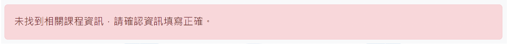
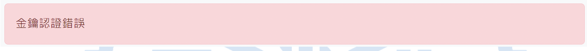
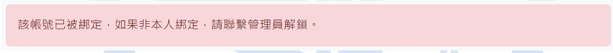

# 01｜帳號啟用教學（Step-by-Step Account Activation Guide）

歡迎使用 ADFP Cloud 2.0！  
本章將完整引導你完成帳號啟用，請依照以下步驟操作，每一步都搭配圖片協助你完成設定。

---

## 🔧 Step 1：進入帳號開通系統

請使用支援瀏覽器（建議 Chrome），開啟以下網址：  
👉 http://ee20.si2.iee.nycu.edu.tw:8080/

你會看到如下畫面，準備輸入個人啟用資料：  

---

## 🧾 Step 2：填寫個人啟用資訊

請根據助教提供的資訊，**正確輸入以下三項欄位**：

1. 課程代號（如：ADFP2025F）
2. 所屬學期（請下拉選擇）
3. 啟用帳號（如：adfp0520，請務必使用助教提供的帳號，不要用到別人帳號！）
4. 其他必要資訊（如：姓名、學號、系所等）
5. 電子郵件地址（非常重要，請確認無誤，未來密碼重設將使用此信箱）

---

## 🗝️ Step 3：上傳金鑰檔案以進行身分驗證

- 點選「選擇檔案」並上傳**助教提供的課程專屬金鑰 (.key) 檔案**
- 點選「下一步」

⚠️ 若出現錯誤，請檢查以下可能：
- 課程代號或帳號輸入錯誤

- 金鑰檔案過期或未授權

- 該帳號已被啟用過

---

## 📋 Step 4：確認資料是否正確

在進入下一頁前，請再次**檢查你的填寫內容**，確認無誤後再繼續。

---

## 📘 Step 5：閱讀並勾選使用規範

請完整閱讀 10 條 ADFP Cloud 使用規範，並逐條勾選 ✅  
這代表你已了解並同意遵守本平台規範。

---

## 📎 Step 6：上傳文件（在學證明與 NDA 切結書）

請依身份準備圖檔（必須為 `.png` 格式）：
1. **在學證明**
  - **陽交大學生**：下載註冊組提供的在學證明，截圖
  - **他校學生**：學生證正反面（需含註冊章）截圖
2. **NDA**：
  - 從頁面下載 NDA，簽名後截圖

操作方式如下：
1. 請根據提示重新命名**檔案名稱**
1. 點選「選擇檔案」
2. 確認檔名，點選「上傳」
3. 預覽確認後，繼續下一步

📷  

---

## 🔒 Step 7：確認送出綁定帳號

最後確認所有資料無誤後：

- 勾選「確認資料無誤」
- 勾選「知悉保密義務」
- 點選「確認綁定帳號」

---

## ✅ Step 8：啟用成功，取得預設密碼

綁定成功後，你將會看到帳號與預設密碼資訊畫面：

- 點選「顯示密碼」查看帳號與密碼
- 立即點選「**下載密碼資訊**」以備日後查詢

---

## 🔁 Step 9：更改密碼（首次登入必須更改預設密碼）

請開啟密碼管理網站：  
👉 https://account.adfp.iee.nycu.edu.tw:5001/

### 更改步驟：

1. 使用預設帳號與密碼登入  
   

2. 若系統跳出強制更改密碼畫面，請依提示操作  

   

3. 若沒有被要求更改密碼，請在登入後，參考下方「[啟用後修改密碼](#step-12-啟用後修改密碼)」步驟進行密碼變更。

---

## 🆘 Step 10：忘記密碼時怎麼辦？

1. 回到登入頁 → 輸入帳號後點選「忘記密碼」  
   

2. 系統將寄出重設連結至你的信箱
   
   

   

3. 點擊信件中的連結，即可設定新密碼
   
   

---

## 📧 Step 11：確認帳號啟用完成

現在你已成功啟用帳號，這組帳號可以用於：
- ADFP 帳號系統 (更改密碼、忘記密碼等)
- VPN 連線 （連線後才可連接遠端桌面）
- ADFP Cloud 2.0/3.0 遠端桌面連線（EDA Tool設計平台）
- ADFP Cloud 2.0/3.0 FTP 檔案上傳（從本地端上傳檔案至伺服器）
- ADFP 助教 Chat 系統 （提問、討論、伺服器內學生上傳檔案給助教批改）

如果登入成功，恭喜你已完成帳號啟用！
但如果無法登入，請檢查以下事項：
- 首次使用務必至ADFP 帳號系統更改預設密碼
- 確認帳號與密碼輸入正確
- 確認網路連線正常
- 確認所有輸入的 IP / Port 都正確
- 嘗試用Step 10 的「忘記密碼」功能重設密碼
- 若仍無法登入，請聯絡助教或管理員協助

---

## 🔑 Step 12：啟用後修改密碼

1. 登入後，點選右上角「個人設定」
   
2. 選擇「修改密碼」
   

3. 依序輸入：
   - 目前密碼
   - 新密碼
   - 確認密碼  
   並點選「套用」後登出  
   

4. 再次登入時，使用新密碼即可

## 🎯 小提醒
- **務必變更密碼並妥善保存**
- 啟用程序應在**帳號核發後 1 個月內完成**
- 若帳號失效請聯絡管理員協助解鎖

---

📘 返回 [主教學首頁](../README.md)
