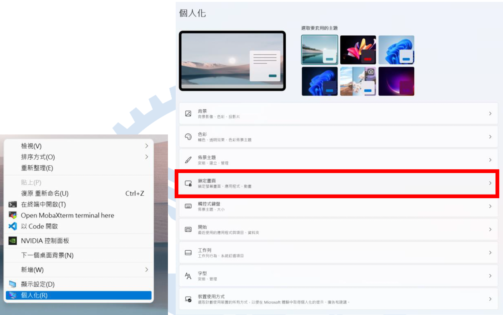
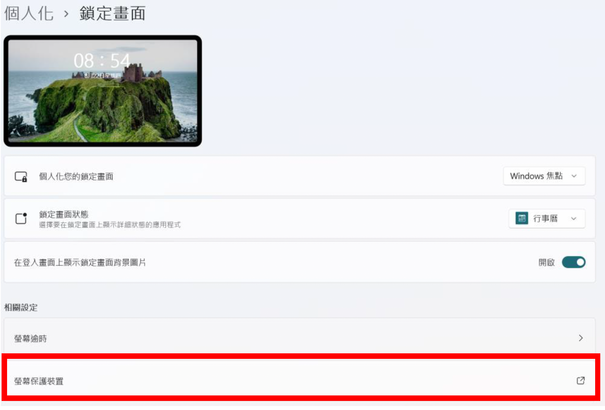
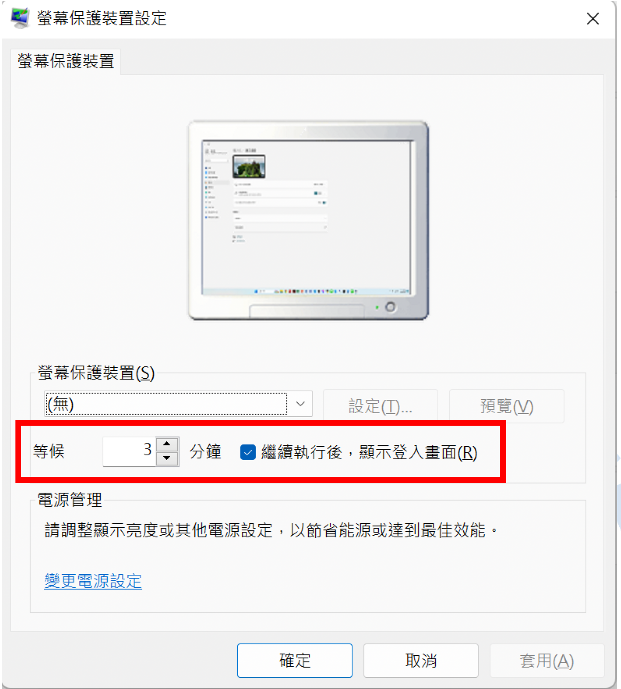

# 02｜Windows 電腦的安全設定

---

為了保護帳號安全，請務必完成以下步驟來強化你的電腦防護：

## 2.1 加強電腦密碼安全性

建議至少要有：

- **10 字元以上**
- **包含英文大小寫 + 數字**

這能有效避免密碼被暴力破解。

---

## 2.2 設定逾時自動鎖定電腦

避免你突然離開座位時，電腦被其他有心人士操作。

---

## 2.3 回到桌面，右鍵點選「個人化」 → 點選「鎖定畫面」

---

## 2.4 點選「螢幕保護裝置」

---

## 2.5 設定螢幕保護時間與登入要求

請輸入以下資訊：

- **等候：3 分鐘**
- ✅ 勾選「繼續執行後，顯示登入畫面」

---

## 2.6 效果驗證

電腦只要**未使用 3 分鐘後會自動鎖定**，需輸入密碼才能重新登入。

---

## 附註

這個設定是為了保障你的帳號與伺服器資安安全，請每位使用者務必完成設定。

📘 返回 [主教學首頁](../README.md)

➡️ 下一章節：
[03 | 安裝：防毒軟體](../03_Antivirus_Setup/README.md)

⬅️ 上一章節：
[01 | 啟用：帳號啟用](../01_Account_Activation/README.md)