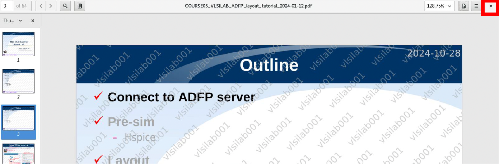

# 08｜製程資料與文件使用說明

ADFP Cloud 2.0 提供完整的 TSMC 16nm 虛擬製程設計資料、元件 IP、標準文件與教學範例。本章將引導你找到這些資料的位置，並說明正確使用方式。

---

## 📂 Step 1：製程資料主資料夾位置

請在遠端桌面中開啟 Terminal，輸入以下指令可進入主資料夾：

```bash
cd /ADFP/Executable_Package
```

### 📁 此資料夾大小：約 17GB

⚠️ **請勿整包複製至家目錄，將會超過儲存空間限制！**

如何使用製程，請參考以下兩份文件教學:
1. Full-custom設計使用者手冊
2. Cell-based設計使用者手冊

* * *

🧱 Step 2：可用製程 IP 與設計素材
-----------------------

| 類型 | 名稱 | 說明 |
| --- | --- | --- |
| Bond Pad | `N16ADFP_BondPad` | I/O 封裝電極 |
| CPU Core | `N16ADFP_CPUCore` | 虛擬 CPU 模組 |
| PLL | `N16ADFP_PLL` | 時脈產生器/相位鎖定迴路 |
| SRAM | `N16ADFP_SRAM` | 單埠與雙埠記憶體 |
| Std Cell | `N16ADFP_StdCell` | 標準邏輯閘 |
| Std IO | `N16ADFP_StdIO` | 標準 I/O 元件 |
| APR/DRC | `N16ADFP_iPDK` | 自動佈局驗證套件 |
| SPICE 模型 | `N16ADFP_SPICE` | 電路模擬參數 |


* * *

📘 Step 3：製程文件資料夾位置
-------------------

可直接從桌面點選捷徑開啟：

```bash
~/Desktop/ADFP_PDF/
```

*   檔案大小約 196MB
    
*   所有檔案皆加浮水印顯示帳號資訊
    
*   文件僅供閱覽，不可截圖或轉發
    

1. 雙擊後，可開啟存放ADFP浮水印文件位置。


2. 可依照使用習慣設定「連續捲動」、「單頁捲動」(推薦)


3. 可使用搜尋功能快速找到所需內容（如「LVS」或「DRC」）
4. 所有ADFP文件，請注意上面有「使用者」浮水印，請勿外洩機密資料。
c
5. 查看完PDF 請務必關閉，否則伺服器會很卡。



* * *

📄 Step 4：常見文件與編號範例
-------------------

| 編號範圍 | 類型 |
| --- | --- |
| ADFP001 ~ ADFP041 | 製程原始技術文件（含 LVS, DRC 規則） |
| ADFP042 ~ ADFP047 | TSMC 教學文件（FinFET 原理、佈局範例）|
| COURSE01 ~ COURSE05 | 陽交大教學簡報（供課堂搭配使用） |

* * *

❗ Step 5：請遵守的文件使用規範
-------------------

*   ✅ 文件僅能透過遠端桌面開啟
    
*   ❌ 不可截圖、拍照或錄影浮水印資料
    
*   ❌ 不可複製、搬移至本機電腦
    
*   ✅ 每次用完請務必關閉文件以釋放資源
    

違反者將依據保密規範停權或列入黑名單

* * *

📚 Step 6：Memory 介紹
--------------------------------

雖然目前不提供 Memory Compiler，但以下幾種 SRAM 模組已內建：

| 類型 | 容量配置 |
| --- | --- |
| Single Port SRAM | 詳見手冊 |
| Two Port SRAM | 詳見手冊 |


* * *

🧠 小提醒
------

| 問題 | 解決方式 |
| --- | --- |
| 看不到 PDF？ | 確認有登入 XRDP 並開啟桌面捷徑 |
| 想用 EDA Tool 開啟設計？ | 請先 `source` 環境後再操作 |
| 家目錄空間不足？ | 請勿複製 `/ADFP/Executable_Package` 整包資料 |

* * *

📘 返回 [主教學首頁](../README.md)