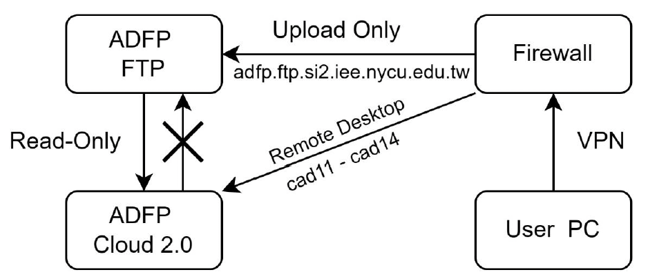
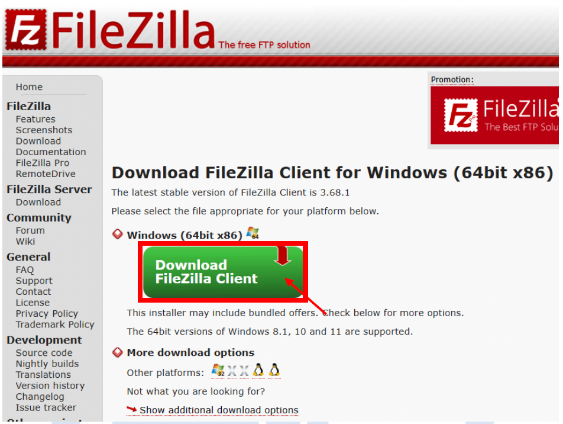
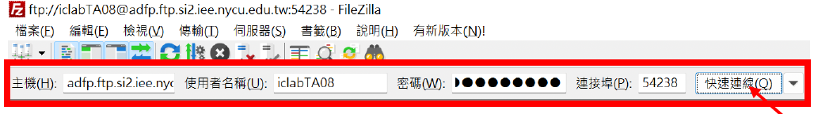
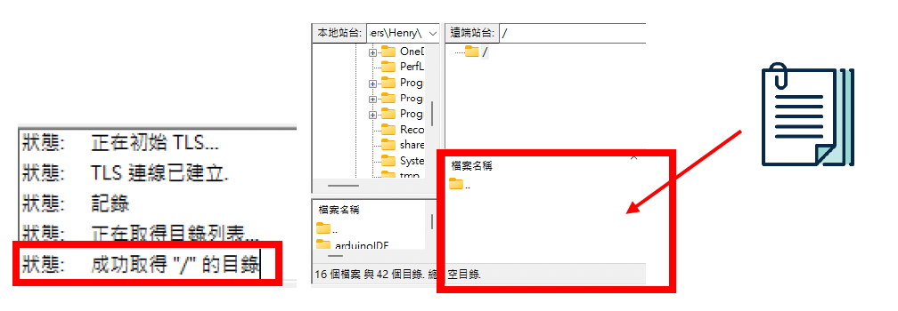
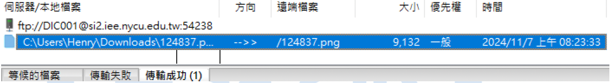
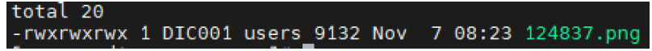

# 09｜FTP 檔案上傳教學

若你需要將設計檔、Verilog、PDF 等從本機電腦上傳至 ADFP Cloud 進行編輯與模擬，請使用 **專屬 FTP 上傳系統**。

> 本系統**僅提供上傳功能**，無法下載、無法列出目錄，確保資料單向進入伺服器、避免機密外洩。

---

## 🔒 系統設計理念

| 行為 | 外部電腦 | ADFP 伺服器內部 |
|------|-----------|----------------|
| 上傳檔案 | ✅ 可透過 FTP 上傳 | ✅ 內部帳號可存取 |
| 下載檔案 | ❌ 禁止外部下載 | ✅ 內部可複製檔案至家目錄 |
| 檔案操作 | ❌ 無法查看或刪除 | ❌ 無法刪除（唯讀空間） |




---

## 💻 Step 1：下載 FTP 軟體

建議使用跨平台免費軟體 [FileZilla Client](https://filezilla-project.org/download.php?platform=win64)



---

## 🔌 Step 2：連接 VPN 後開啟 FTP 軟體

請先確認你已經成功連上 ADFP VPN（見第 5 章）

再打開 FileZilla，準備輸入以下資訊：

| 欄位 | 值 |
|------|----|
| Host（主機） | `ftp.adfp.iee.nycu.edu.tw` |
| Username | 你的帳號 |
| Password | 你的密碼 |
| Port | `54238` |




---

## 📤 Step 3：開始上傳你的資料夾或檔案

1. 準備好要上傳的檔案（建議使用 `.zip` 或 `.tar.gz` 壓縮）  
2. 從 FileZilla 左側選取本機檔案  
3. 拖曳到右側欄位（即使顯示空白，仍可正常上傳）  



✅ 出現在下方「成功傳輸」欄，即代表已成功上傳！



---

## 📂 Step 4：在伺服器內部讀取檔案

登入 XRDP 遠端桌面後，請開啟 Terminal，輸入：

```bash
cd /FTP_UPLOAD/
ls
```

你應該可以看到你所上傳的檔案名稱。



若要將檔案複製到個人家目錄，請使用：

```bash
cp your_file.zip ~/
```

* * *

⏳ Step 5：注意事項與限制
----------------

*   `/FTP_UPLOAD/` 為「唯讀暫存區」
    
    *   ⛔ 無法刪除 / 編輯檔案
        
    *   ✅ 可讀取、可複製回家目錄使用
        
*   系統會**每兩小時清空** `/FTP_UPLOAD/` 內容
    
*   上傳後請**立即登入遠端桌面複製備份**
    

* * *

❓ 常見問題
------

| 問題 | 解決方式 |
| --- | --- |
| 為什麼右側檔案列表是空的？ | FTP 為安全設計，不顯示任何目錄 |
| 可以上傳什麼檔案？ | `.tar.gz`, `.zip`, `.v`, `.fsdb`, `.sdf` 等皆可 |
| 為什麼檔案過一段時間會消失？ | 系統會自動清空 FTP 上傳暫存區（每兩小時） |

* * *

📘 返回 [主教學首頁](../README.md)

➡️ 下一章節：
[10 | ADFP Chat 問答系統 ](../10_Chat_System/README.md)

⬅️ 上一章節：
[08 | 製程資料存取](../08_Process_Data/README.md)