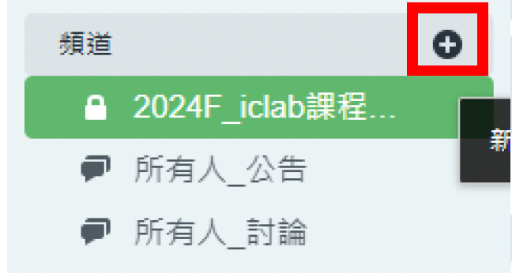

# 10｜Chat 問答系統操作教學

本章介紹伺服器端內部使用的聊天室功能，供同學提問、助教即時回覆，並支援課程公告與作業討論。

聊天室採用 Synology Chat 架設，僅能透過 VPN 連線後於伺服器內部使用，帳號為個人帳號與 VPN 相同。

---

## Step 1：登入 Chat

1. 需先成功登入 ADFP VPN（見 05_VPN_Connection）
2. 開啟瀏覽器進入：
   > https://adfp.account.si2.iee.nycu.edu.tw:20001

登入畫面如下圖：


使用與 VPN 相同帳號密碼登入。

登入後畫面如下圖：


---

## Step 2：介面導覽

介面與 Slack 類似：

📷  


使用者介面包含三個不同區塊：
- **頂端全域欄位**：包含套件標誌、搜尋列、個人資料圖片。
- **左側欄位**：包含以下三個區塊。
  - **頻道**：頻道可以讓群體成員討論特定主題，頻道成員無數量上限。
  - **對話**：對話為私密的通訊系統，能夠與單一對象或小型團體進行交談。
    對話成員數量上限為九人，此上限包含建立者。
  - **機器人**：機器人是一項整合功能，可透過與您的一對一對話來傳送與接收訊息。
- **主視窗**：包含訊息與設定、佈告欄、我的收藏區塊。


---

## Step 3：頻道類型

在 ADFP Chat 中，頻道分為 公開頻道 和 私密頻道：

- **公開頻道**
任何人都可以找到並加入公開頻道，適合全體成員一起參與或接收公告。
公開頻道適合用於交流和其他課程相關的資訊，所有學生均可自由加入。
- **私密頻道**
只有被邀請的成員才能看到並加入私密頻道，適合小組或課程專屬討論。
建議助教為每門課程設立一個私密頻道，作為與該課程學生交流的空間，便於解答問題、進行討論。
- **對話群組**
可與單人或多人建立私訊討論群組，適合一對一或小組討論。

---

## Step 4：加入頻道

要加入頻道，請依照以下步驟：
1. 點擊左側面板頂端的「尋找」按鈕或使用快捷鍵 Ctrl + K
2. 選擇「頻道」頁籤瀏覽所有頻道列表，或使用右上角搜尋列輸入
3. 點擊頻道名稱即可進入或加入公開頻道，對於未加入的公開頻道，點擊後可預覽頻道內容再決定是否加入
4. 若是私密頻道，需助教邀請才能加入


若要建立新頻道，請依照以下步驟：
1. 在左側欄位點選「頻道」區塊。
2. 點擊左上方的「+ 新增頻道」圖示。


3. 根據需求選擇「公開頻道」或「私密頻道」：
   - **公開頻道**：所有成員可見，無需邀請
   - **私密頻道**：僅頻道成員可見，適合特定群體使用
4. 輸入頻道名稱（不可重複），並填寫目的
    （選填）以描述頻道用途。
    建議可以以以下命名規則：`2024F_[課程名稱]討論群`

5. 邀請成員：從下拉式選單選擇要加入頻道的成員，確保頻道成員只有相關課程的學生和助教。這個步驟會比較累一點，請依序將同學加入，點選完後按「建立」。

6. 新的頻道建立完成。


---

## Step 5：發文與討論

1. 頻道內的功能
- **使用標籤建立問題串**
在頻道中使用 #標籤名稱（如 #作業問題）可建立特定話題的討論串，所有成員可在此標籤下留言，形成易於追蹤的問題串，便於找到相關答案。
- **釘選訊息**
助教可以釘選重要訊息（例如作業截止時間或課程重點），點擊訊息右上角的 釘選圖示 後，訊息將出現在公告欄中，方便頻道成員快速查看。
- **投票功能**
使用 投票圖示 建立投票，輸入問題和選項，用於快速收集課程反饋。助教可選擇是否允許匿名投票或多選。

2. 學生/助教提問流程
   
    1. 使用 **#標籤** 來分類問題
    當學生有問題需要提問時，建議在訊息中使用 # 來加上標籤，例如 #作業問題 或 #安裝問題。這樣可以在頻道中將每個問題歸類，便於所有成員快速搜尋與查看特定主題下的討論。
    範例：
        ```
        #模擬錯誤  
        請問我在執行 irun 的時候出現 undefined module 是什麼原因？
        ```
        
    2. 使用 **@提及** 來通知相關人員
    當需要特定人員回覆時，可以使用 @提及 功能，直接在訊息中提及該成員的名稱，系統會自動通知該成員。
    可直接道中輸入訊息，也可建立「討論串」集中回覆。
    3. 使用 **討論串** 來集中回覆
    為了便於針對特定問題進行深入討論，學生可以在問題訊息上方點擊發起討論串圖示。開啟後的討論串會顯示在原始訊息之下，讓問題的討論能夠保持在同一串中。
    
    參與討論串：助教和其他學生可以在討論串中回覆，並點擊訂閱圖示以便隨時接收到討論更新通知，確保對問題的回覆不會遺漏。
    
    查看訂閱的討論串：點擊右上方我的收藏圖示以查看已訂閱的討論。
    

3. 使用 **表情符號** 來互動
- 在 ADFP Chat 中，學生和助教可以用表情符號或貼圖來表示對回覆的贊同或反對，增加溝通的互動性。這樣的回應方式既快速又不打斷討論流程。
加入表情符號：將游標移至想表達感受的訊息上方，點擊新增感受圖示，選取表情符號。點擊已存在的表情符號會增加該表情的數量，表達支持。，例如使用 👍 代表贊成，或 👎 代表反對。


4. 使用 **檔案上傳** 功能
- 當學生需要上傳檔案或圖片（如錯誤截圖、程式碼片段等）時，可以點擊訊息輸入列下方的
- 📎 圖示來上傳檔案。這樣可以讓助教更清楚地了解問題情況，並提供更精確的解答。


---

## Step 6：標籤與分類

- 請使用 `#` 加上問題標題分類，例如：`#模擬錯誤`  
- 方便助教追蹤與後續查找

---

## Step 7：投票與釘選

聊天室支援：

- ✅ 建立投票  
- ✅ 釘選訊息至頻道頂端

---

## Step 8：上傳檔案與圖片

- 可點選訊息輸入列下方「📎」上傳圖片、截圖與其他附件  
- 建議使用 Screenshot 工具擷取錯誤畫面並上傳

---

## Step 10：建立對話（私訊）

左側欄位點選 `+對話` 建立新對話。

- 可建立一對一或多人群組對話（最多 9 人）

📷  


---

## Step 11：使用注意事項

| ✅ 推薦行為 | ❌ 禁止行為 |
|------------|-------------|
| 僅限 VPN 連線使用 | 截圖分享至 FB、Line |
| 提問附截圖與 Log | 在頻道內大量 @所有人 |
| 保持禮貌與清楚描述 | 發送與課程無關訊息 |

---

📘 返回 [主教學首頁](../README.md)


