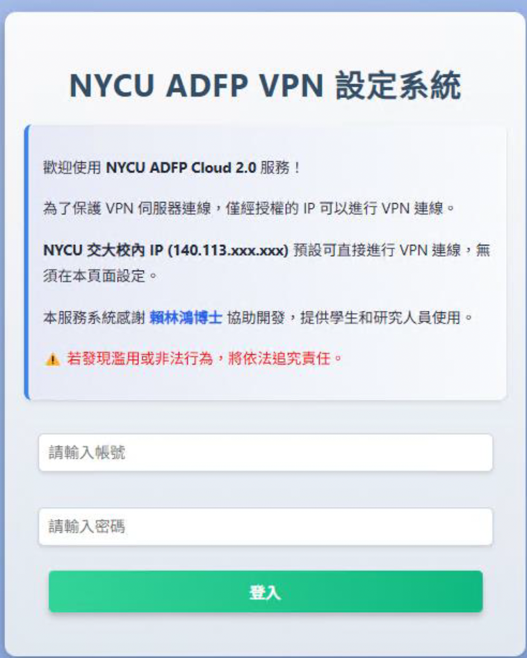
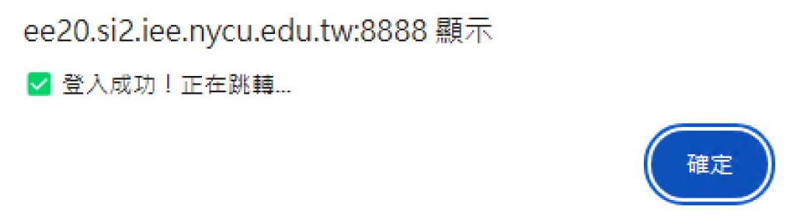
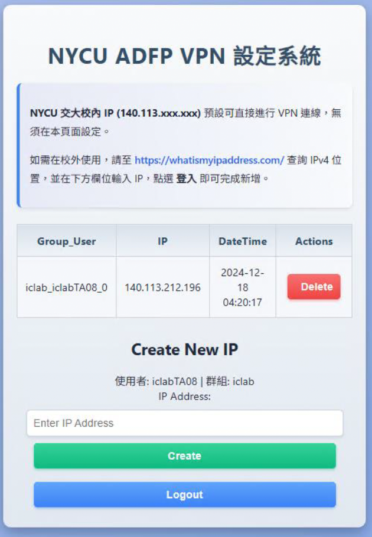

# 11｜Off-Campus VPN 設定指引

> 本章說明：如何在校外使用 ADFP VPN 系統

由於 ADFP Cloud 2.0 為強化 VPN 安全性，僅允許特定 IP 地址進行連線。校外使用者須先「新增授權 IP」，才能從外部正常連線 VPN。

---

## 📌 校內/校外連線原則

| 使用者位置 | 是否需設定 |
|------------|-------------|
| 校內（NYCU） | ❌ 無需設定，預設開啟 |
| 校外（宿舍、台灣各地、國外） | ✅ 需設定 IP 授權 |

---

## Step 1：前往設定網站（需在交大校內 IP 內進行）

請開啟瀏覽器，輸入下列網址：

> http://ee20.si2.iee.nycu.edu.tw:8888/

> ⚠️ 此網站只能從交大校內（140.113.xxx.xxx）開啟，請使用校內網路或 VPN 中繼登入。

---

## Step 2：登入 VPN 設定系統

輸入你的 VPN 帳號與密碼（與申請 VPN 時相同），點選【確定】登入。

---

## Step 3：查詢你目前的外部 IP 位址

請使用下列工具查詢你目前在使用的 IPv4 位址：

👉 https://whatismyipaddress.com/

---

## Step 4：將查到的 IP 新增至授權列表

回到 VPN 設定系統頁面：

1. 在空白欄位輸入查到的 IP 位址  
2. 點選【Create】

---

## Step 5：完成設定

新增成功後，即可從你目前的位置使用 VPN 連線。

若需移除該 IP 授權，點選【Delete】即可刪除。

---

## ❗ 注意事項

- 每次換網路（如宿舍 ↔ 家裡）都需要重新新增 IP
- 系統目前僅支援 IPv4，請勿填入 IPv6 格式
- 若無法進入設定網頁，請至 Discord 群組尋求協助

---

📘 返回 [主教學首頁](../README.md)

➡️ 下一章節：
[常見伺服器問題](../12_Common_Server_Issues/README.md)

⬅️ 上一章節：
[10 | ADFP Chat 問答系統](../10_Chat_System/README.md)