# 💬 Discord 社群操作手冊

本指南將協助你一步一步加入並使用 ADFP/EEHPC 專屬的 Discord 技術支援社群。  
請同學與助教務必加入，以即時掌握伺服器狀態、更新、與問題回報方式。

👉 立即加入： https://discord.gg/3HF8b8WDju

---

## 🚀 1. 安裝與帳號註冊

### 1.1 下載 Discord

Web page: https://discord.com/

依照官方說明下並安裝 Discord 伺服器 (或是使用網頁版)  
註冊帳號並綁定 email 以增加安全性（建議使用）

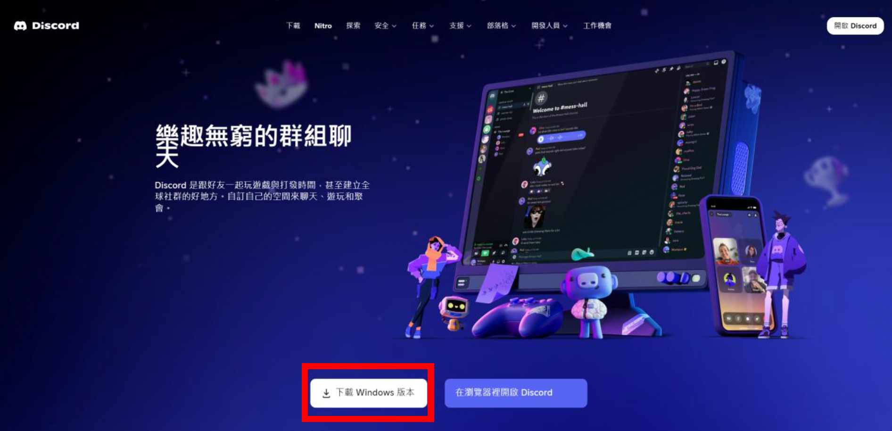

### 1.2 Discord 個人化設定

在應用程式左下角的齒輪符號中選取【個人資】  
依照您的喜好進行個人化設定，例如：個人資料與頭像

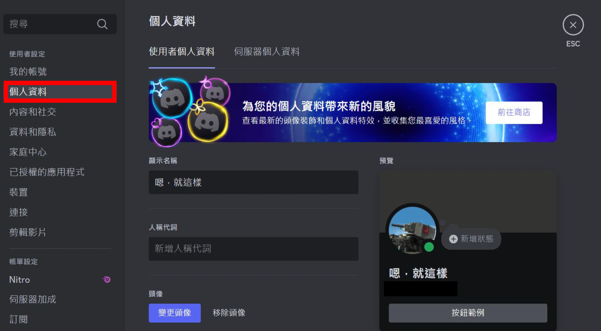

在選擇完您的角色後，請按【下一頁】。

---

## 👥 2. 加入伺服器與初始設定

### 2.1 加入伺服器
點擊以下連結加入伺服器：  
🔗 [https://discord.gg/3HF8b8WDju](https://discord.gg/3HF8b8WDju)

### 2.2 回答基本問題

#### 2.2.1 選擇您的角色

在一開始，請您選擇您希望擁有的身分（可以複選）

- **TA**：使用伺服器的課程助教  
  請注意如果您選擇此選項，請**務必**至 #身分組領取 頻道中與管理員聯絡，以便確認您的課程助教身分！
- **Researcher**：使用伺服器的研究人員  
  使用伺服器進行研究的人員可以選擇此標籤，我們將為您自動附上研究者的標籤，以便我們在處理您的問題時能夠了解您的身分。
- **Student**：使用伺服器進行學習的學生  
  若您是使用伺服器進行學習的學生，可以在這邊領取學生身分。  
  
 ⚠️ 不過我們建議您若是有任何問題，請先連絡您課程的負責助教進行問題排解，以便更快的獲得解答！

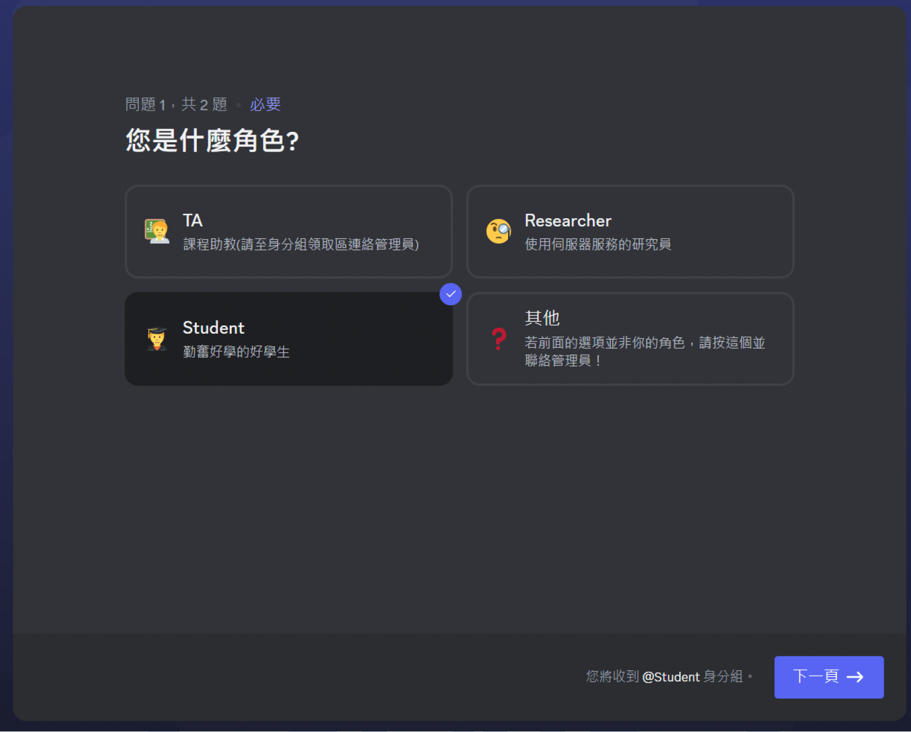

#### 2.2.2 選擇您想要收到的通知

在您選擇完適合您的身分之後，您可以自由的選擇想要收到的伺服器通知(非必填，可複選)
- **ADFP使用者**
選擇該身分時，若是有ADFP伺服器的相關重要資訊，您將會被以提及(@)的方式收到相關資訊，以確保您能夠及時獲取最新相關資訊！
- **EEHPC使用者**
選擇該身分時，若是有EEHPC伺服器的相關重要資訊，您將會被以提及(@)的方式收到相關資訊，以確保您能夠及時獲取最新相關資訊！
- **以上皆不選擇**
若是您以上兩個選擇都不點選，您將不會收到任何有關伺服器的重要告知提及！

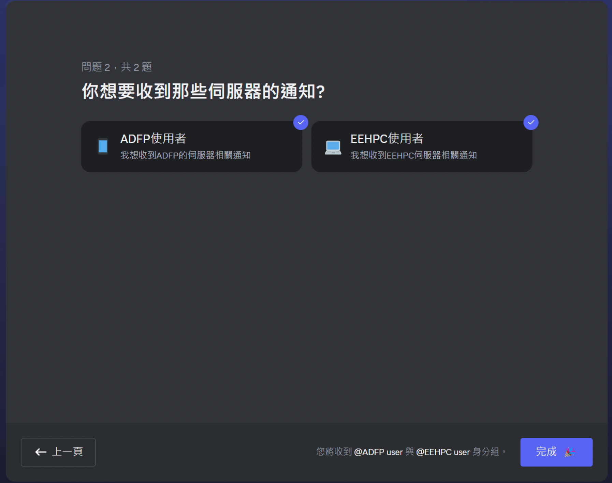

在選擇完成後，按下【完成】按鈕以完成本伺服器之初使設定。

---

### 2.3 更改您的暱稱（非常建議）

本動作並非必要步驟，但我們強烈建議您這麼做！
更改您在本伺服器中顯示的暱稱可以讓我們更快速的協助您。

步驟：
1. 左下角齒輪符號【使用者設定】
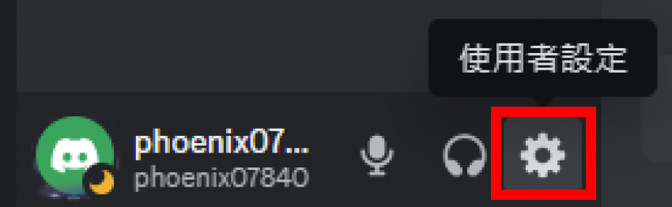
2. 點選【個人資料】→【伺服器個人資料】
3. 選擇本伺服器，並將暱稱改為您的名字
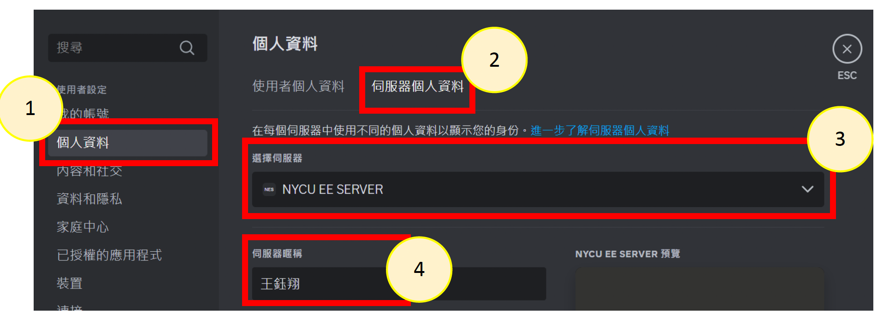

---

### 2.4 領取身分（課程助教或是特殊角色）

若是您並非課程助教或是需要取得特殊身分的人員，可以忽略此步驟。
1. 請至左側面板點選【身分組領取】頻道

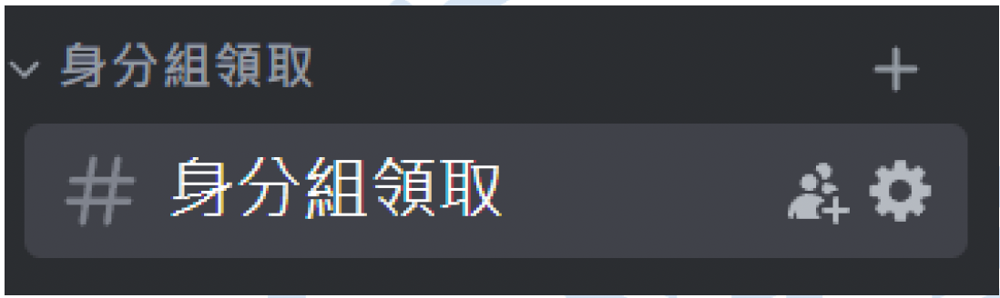

2. 在頻道中聯絡管理員，說明您的需求。 
例如：「我是 ICLAB 的助教，我想要領取 TA 的身分組，麻煩認證我的身分。」

3. 管理員在確認您的身分後會為您加上符合您的身分組。

⚠️ 請注意本伺服器並不提供助教與學生之間的溝通，我們建議您做為課程助教可以建立屬於您自己的課程伺服器並開放給學生討與詢問相關問題。

---

### 2.5 將特定頻道靜音

在#eehpc伺服器狀態頻道中，會有機器人每5分鐘為您更新EEHPC伺服器的狀態。
為了防止過多訊息打擾到您的安寧，我們建議您可以將該頻道靜音。
1. 右鍵點選#eehpc伺服器狀態頻道
2. 選擇【將頻道靜音】
3. 選擇【直到重新啟動】

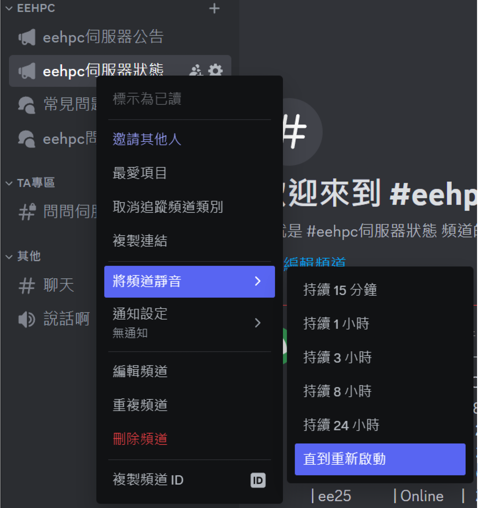

將頻道靜音後，您將不在收到更新通知，不果您仍然可以點選該頻道以隨時查看伺服器狀態！
此外，在#welcome頻道中，每當有人加入伺服器，您也會收到相關的訊息，因此也建議您參考前面的步驟將該頻道靜音！

---

## 📡 3. 頻道介紹
若您完成了以上所有步驟，您可以開始瀏覽各個頻道或是在特定的頻道提出您的問題。
為此，以下我們將為您一一介紹各個頻道：

### 🔧 伺服器資訊類
- `#rules`：規則與操作指引
- `#公告`：官方公告區
- `#welcome`：新進用戶歡迎（建議靜音）
- `#身分組領取`：聯絡管理員認證身分
- `#聊天`：自由閒聊
- `#語音聊天`：語音交流頻道

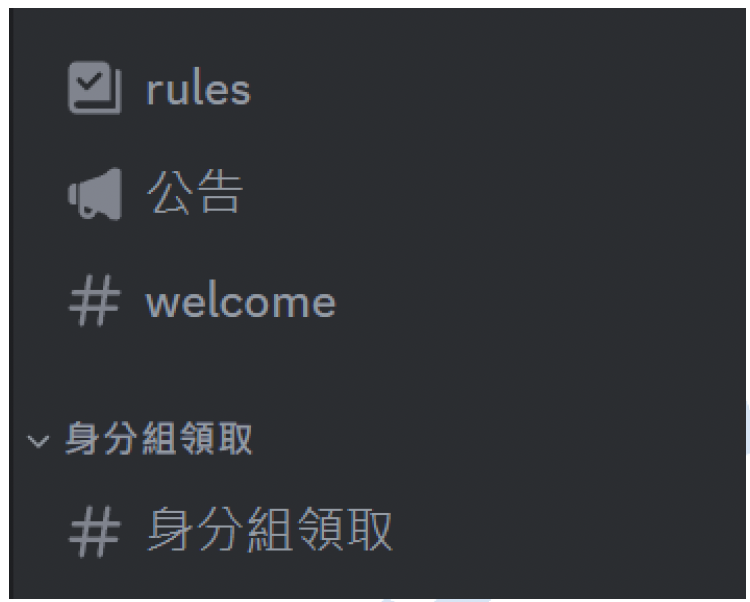

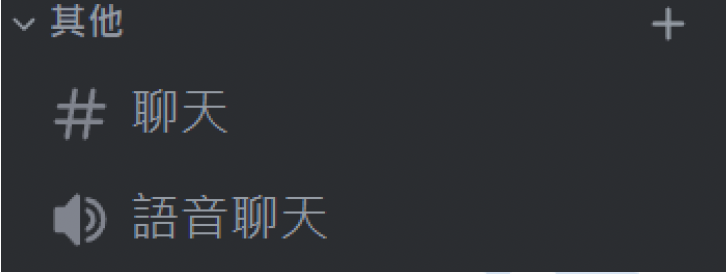

### 🧬 ADFP 專區
- `#adfp 伺服器公告`：本頻道將公告有關ADFP伺服器的相關重要資訊，例如伺服器重啟通知。
- `#常見問題`：在此您可以看到有關ADFP伺服器的常見問題與解決方法(您沒有權限在此發文)。
- `#adfp 問問題`：您可以在此建立貼文詢問ADFP伺服器相關問題(發文請參考4)

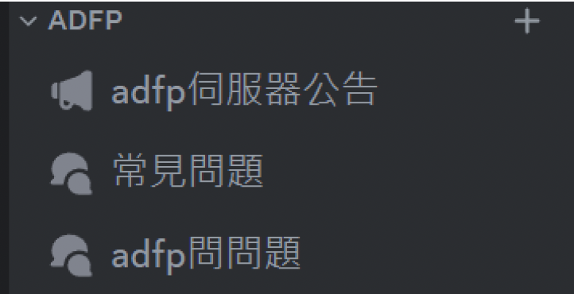

### ⚙️ EEHPC 專區
- `#eehpc 伺服器公告`：本頻道將公告有關EEHPC伺服器的相關重要資訊，例如伺服器重啟通知。
- `#eehpc 伺服器狀態`：本頻道提供您即時的伺服器狀態，機器人將在每5分鐘在此頻道為您更新伺服器狀態的最新資訊，為了避免過多的訊息打擾到您，建議您將該頻道設靜音(請參考2.5)
- `#常見問題`：在此您可以看到有關EEHPC伺服器的常見問題與解決方法(您沒有權限在此發文)。
- `#eehpc 問問題`：您可以在此建立貼文詢問EEHPC伺服器相關問題(發文請參考4)

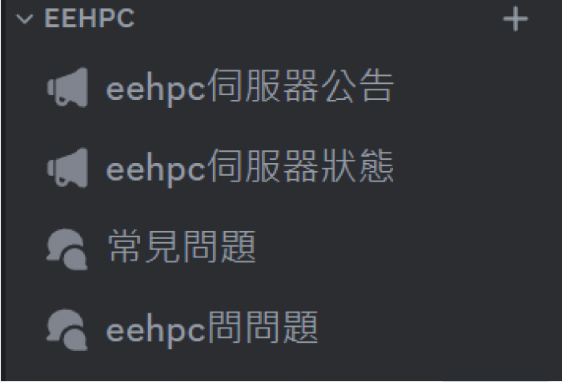

### 🎓 TA 專用頻道
- `#問問伺服器管理員`：課程助教專用問答頻道（需 TA 身分）
本頻道提供給您身為課程助教的專用問答區，在這裡，您可以詢問有關伺服器(ADFP/EEHPC)，或是課程帳號等任何問題。在此頻道發言時，負責相對應問題的管理員將會以最快的速度回復您！

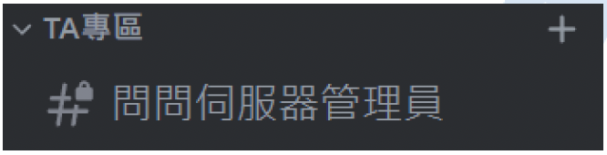

---

## ❓ 4. 提問教學
若您有問題想要詢問，請遵照以下的發文方法以便我們進行回復。

⚠️ 建議您在發問之前，參考#常見問題頻道，或是使用搜尋功能來尋找是否已經有人提出類似問題。

### 4.1 發佈問題
請在 `#adfp 問問題` 或 `#eehpc 問問題` 提問，依以下步驟：

1. 點選右上角「新貼文」
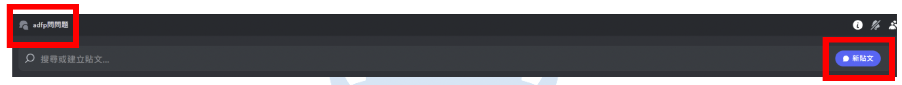
2. 明確描述問題，**務必提供姓名與帳號**
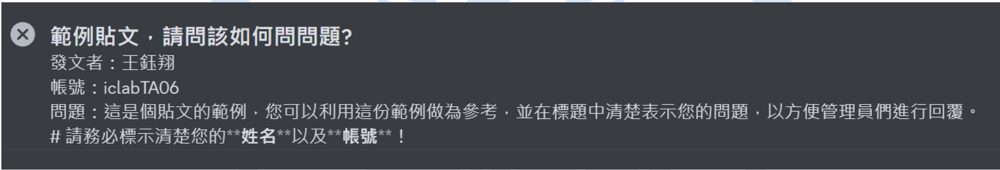
   - 例如：「我是王小明，帳號為 `adfp2024`，在使用 ADFP 時遇到模擬錯誤，請問如何解決？」
   - 請務必填寫清楚您的姓名與帳號，以便管理員進行回復。您也可以在貼文中加入圖片，以方便管理員更快速的理解您的問題。
3. 點選【貼文】按鈕，並等待管理員回覆
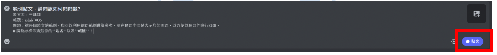
4. 管理員回覆後可繼續對話追蹤

### 4.2 問題沒有解決

若管理員回覆後，您的問題仍然沒有得到解決，您可以再貼文中與管理員進行近一步的對話。

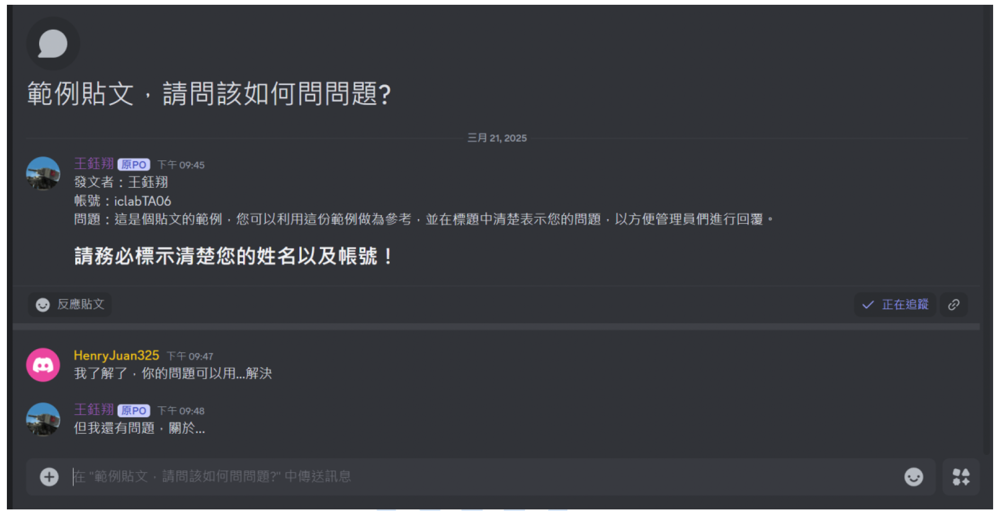

### 4.3 提問重點整理

- 在相對應的區域提問
- 標題中說明問題
- 內文註明姓名與帳號
- 學生優先詢問 **課程助教**
- 若無回覆，**可 @管理員**

---

## 📬 5. 聯絡資訊（如特殊需求）

請勿使用 Discord 私訊管理員，請公開留言或聯絡以下成員：
[管理員頁面](https://iclab.iee.nycu.edu.tw/iclab/team.html)

---

## 🛡️ 請同學與助教務必加入

所有伺服器異動（如重啟、維護）公告 **僅於 Discord 發布**，  
**不再發送 Email 通知**，敬請加入以免錯過重要資訊！

---

📘 返回 [主教學首頁](../README.md)

⬅️ 上一章節：
[11 | 校外 VPN 設定教學  ](../11_OffCampus_VPN/README.md)